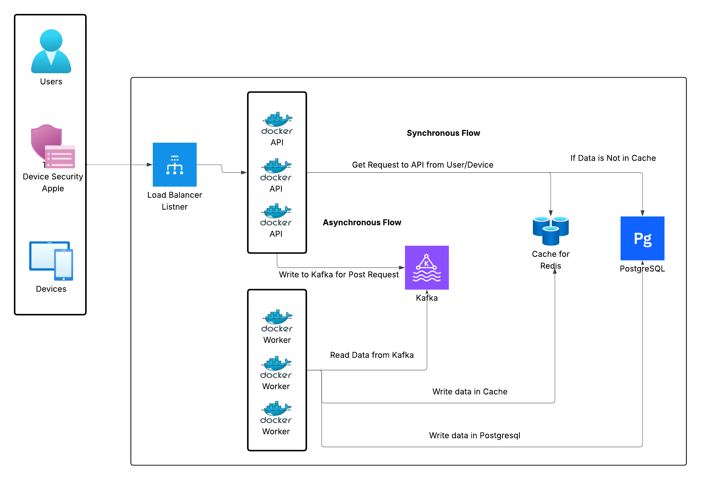

# Backend Services Architecture

## Overview
- **Context**: Multiple small applications and edge devices push data into this backend. Some calls are synchronous `GET` requests that must return data quickly, while other workloads are asynchronous event submissions that can be processed out of band. To ensure fast `GET` responses, recently processed data is cached so devices see low-latency reads even during bursts of ingest traffic.
- **API service (FastAPI)** handles synchronous client traffic, JWT-secured authorization, and pushes asynchronous workloads into Kafka. It is built on Python 3.11 and packaged with Docker for deployment on AWS ECS behind an Application Load Balancer (ALB).
- **Worker service (Kafka consumer)** reads events from Confluent Cloud Kafka, persists canonical data into PostgreSQL, and maintains Redis cache coherence. It also runs on Python 3.11 inside Docker/ECS tasks.
- **Core technologies:** FastAPI, SQLAlchemy + PostgreSQL, Redis (compatible with AWS ElastiCache), Confluent Cloud Kafka with SASL_SSL/PLAIN auth, JWT-based auth, structured JSON logging, and ECS for container orchestration.

## Service Responsibilities
- **API service**: Validates JWTs, serves HTTP endpoints, reads from Redis/PostgreSQL, and produces device events to Kafka. All synchronous traffic flows through this FastAPI application.
- **Worker service**: Consumes the Kafka topics, upserts canonical records into PostgreSQL, and refreshes or invalidates Redis cache keys so reads stay warm.
- **PostgreSQL**: Source of truth for processed resources and durable state that powers analytics and API lookups.
- **Redis**: Low-latency cache for `GET` workloads; workers keep it synchronized after database writes.
- **Kafka & Kafka UI**: Kafka holds asynchronous workloads (events + DLQ). Kafka UI, available at `http://localhost:8080`, is an optional developer tool for inspecting topics locally.

## Architecture Diagram


```
Clients
   |
   v
+---------+      +----------------------------+
|   ALB   |----->| API Service (FastAPI, ECS) |
+---------+      +----------------------------+
                   |   |   |
                   |   |   +--> Reads/Writes PostgreSQL (RDS/Aurora)
                   |   +------> Read-through cache via Redis (ElastiCache)
                   +----------> Produces events to Kafka (Confluent Cloud)

            +----------------------------------------+
            |        Confluent Cloud Kafka           |
            |  (events-input topic, events-dlq)      |
            +-------------------+--------------------+
                                |
                                v
                    +------------------------------+
                    | Worker Service (ECS tasks)   |
                    +------------------------------+
                       |            |
                       |            +--> Invalidates Redis cache entries
                       +--------------> Upserts payloads into PostgreSQL

Legend:
- ALB distributes HTTPS traffic to API tasks.
- Kafka acts as durable buffer/ordering layer between API and worker.
- Redis + PostgreSQL live in AWS (ElastiCache + RDS/Aurora).
- Workers scale independently based on Kafka lag.
```

## Design Rationale (Why this architecture?)
- **Fast reads with Redis**: When a device asks for `GET /resource/{id}`, it should not wait on the database every time. We cache the JSON blob in Redis so most reads are served in milliseconds, while PostgreSQL only handles occasional cache misses. This keeps latency predictable even if thousands of devices poll at once and aligns with the goal of getting data back to end users as quickly as possible.
- **Async writes with Kafka**: `POST /events` can arrive in bursts and usually triggers heavier business logic. Instead of doing all the work during the HTTP request, the API drops the event onto Kafka and replies immediately. Workers process the queue at their own pace, so the API never blocks on downstream systems. Some devices lack a retry mechanism, so pushing events into Kafka ensures they are durably stored and can be retried by our own workers even if the original sender never resubmits.
- **Two separate services**: The API focuses on HTTP traffic and authentication. The worker focuses on long-running processing. Keeping them separate means we can scale them independently, deploy them on different schedules, and prevent slow consumers from affecting API latency.
- **Managed Kafka (Confluent Cloud)**: Running our own Kafka cluster is hard. Confluent Cloud gives us managed brokers, built-in monitoring, and strong durability. Using the `device_id` as the Kafka key preserves ordering per device, which keeps our processing logic simple.
- **ECS for orchestration**: Amazon ECS provides a managed control plane for containers. Each service runs as its own ECS service, letting us set different autoscaling rules, IAM roles, and networking policies. It’s a good fit when we already run on AWS and want cost control without managing Kubernetes.
- **PostgreSQL as the source of truth**: Once the worker finishes processing an event, the canonical record lives in PostgreSQL. We rely on its ACID guarantees, powerful queries, and familiarity for analytics teams.
- **JWT authentication with roles**: Devices and admin tools authenticate with signed JWTs, so no session store is needed. The roles inside the token (`user`, `device`, `admin`, etc.) let us guard endpoints with clear authorization rules.

## Data Flow
### GET /resource/{id}
1. FastAPI verifies JWT and role requirements.
2. Service checks Redis for `resource:{id}`.
3. On hit → return cached payload.
4. On miss → read from PostgreSQL, return 404 if absent.
5. When found, cache value with short TTL (e.g., 60s) and respond.

### POST /events
1. FastAPI validates payload, enriches with `request_id`, `user_id`, and timestamp.
2. Message is produced to Kafka topic `events-input` using `device_id` as the key to preserve ordering.
3. API returns `202 Accepted` immediately, decoupling client latency from processing.

### Worker processing
1. Worker consumer in group `events-processor` polls Kafka.
2. For each message it upserts payload into PostgreSQL using `device_id` as resource id.
3. Redis cache entry for that `device_id` is invalidated to keep reads consistent.
4. Offsets are committed only after success or when the message is routed to DLQ.

### Kafka movement
- Events flow from API → `events-input` topic → worker consumer group.
- Failed events after retries are produced to `events-dlq` with error metadata for later inspection.

## Component Responsibilities
- **API service**: JWT verification, role enforcement, GET read-through cache, POST ingestion, Kafka producer lifecycle, application logging.
- **Worker service**: Kafka consumption, retry orchestration, DB upserts, Redis invalidation, DLQ publication.
- **Redis**: Acts as short-lived cache for resources, reducing DB reads and enabling low-latency GET responses.
- **PostgreSQL**: Durable storage of processed resource data and audit-friendly schema.
- **Kafka**: `events-input` buffers ingest traffic; `events-dlq` isolates poison messages for manual remediation.
- **ECS**: Runs both services as separate ECS services (`api-service`, `worker-service`) with IAM roles, autoscaling, and deployment orchestration.
- **Authentication layer**: PyJWT-based decoding plus role validation ensures only authorized actors call endpoints.

## Reliability and Fault Tolerance
- **Kafka buffer**: Provides durable, replayable queue between API and worker to absorb spikes or outages.
- **Worker retries**: Each message retries up to three times with exponential backoff (2^n seconds) before hitting DLQ.
- **Dead-letter queue**: Captures problematic payloads with error details, preventing one bad message from blocking a partition.
- **Stateless API**: Instances can be replaced or scaled without draining state; load balancer distributes traffic.
- **Cache invalidation**: Worker removes Redis keys after database updates, ensuring stale data is short-lived.

## Scalability Strategy
- **API layer**: ECS service can auto-scale based on CPU, memory, or ALB request count; stateless design simplifies scaling out.
- **Worker pool**: Scale worker tasks according to Kafka consumer lag to maintain near-real-time processing.
- **Kafka partitions**: Add partitions to `events-input` to increase parallel consumption while keeping per-device ordering (hash by `device_id`).
- **Redis**: Vertical scaling or clustering via ElastiCache supports high read throughput; TTL tuning controls memory usage.

## Security Considerations
- **JWT + RBAC**: Ensures each request carries verifiable identity and allowed roles.
- **Secrets management**: Environment variables (e.g., DSNs, Kafka creds, JWT secrets) are expected to be injected via AWS Secrets Manager or ECS task secrets.
- **TLS**: Kafka producers/consumers connect to Confluent Cloud over SASL_SSL with TLS encryption; API traffic terminates at ALB with HTTPS.
- **Log hygiene**: Structured JSON logs avoid storing sensitive payload data, focusing on request IDs and metadata.

## Deployment on ECS
- Two ECS services:
  - `api-service`: Exposed through ALB listener → target group → ECS tasks running FastAPI/uvicorn containers.
  - `worker-service`: Runs background consumer tasks without ALB, optionally in private subnets.
- Independent autoscaling policies allow API tasks to scale on HTTP metrics while worker tasks scale on Kafka lag or CPU.
- Shared Docker images reside in ECR; CI/CD pushes new tags and triggers rolling deployments.

## Containerization
- **Dockerfiles** now live with their services:
  - API: `backend/api_service/Dockerfile`
  - Worker: `backend/worker_service/Dockerfile`
- Both images share the same Python 3.11 base, install `build-essential`, copy `backend/shared`, and install dependencies from `backend/requirements.txt`. Because the build context is the `backend/` directory, each Dockerfile references files such as `requirements.txt`, `shared/`, and the service folder with relative paths.
- Example local build commands (from the repository root):
  ```bash
  docker build -f backend/api_service/Dockerfile -t api-service:dev backend
  docker build -f backend/worker_service/Dockerfile -t worker-service:dev backend
  ```

## How to Run Locally
### Option A: Native environment
```bash
# Install dependencies
pip install -r backend/requirements.txt

# Start API service (default port 8000)
cd backend
uvicorn api_service.main:app --reload

# In a second terminal, start worker service
cd backend
python -m worker_service.main
```
Ensure PostgreSQL, Redis, and Kafka instances (local or remote) are reachable and environment variables in `shared/config.py` are populated accordingly.

### Option B: Docker Compose (full stack)
```bash
cd backend
# Compose V2
docker compose up --build
# Or Compose V1
docker-compose up --build
```
This spins up Postgres, Redis, Kafka (KRaft), Kafka UI, and both services with the environment variables defined in `backend/docker-compose.yml`. The API becomes available at `http://localhost:8000`, Kafka UI at `http://localhost:8080`, and the backing data stores on their default ports (5432 for Postgres, 6379 for Redis, 9092 for Kafka). Run `docker compose ps` (or `docker-compose ps`) anytime to confirm every container is healthy.

## How to Test
1. **Start the stack** using either Option A or Option B above. Make sure PostgreSQL, Redis, Kafka, API, and worker containers are healthy (`docker-compose ps`).
2. **Generate a local JWT** signed with the `local-dev-secret` so you can hit protected endpoints:
   ```bash
   python - <<'PY'
   import datetime as dt, jwt
   token = jwt.encode(
       {
           "sub": "device-tester",
           "roles": ["device", "user"],
           "exp": dt.datetime.utcnow() + dt.timedelta(hours=1),
       },
       "local-dev-secret",
       algorithm="HS256",
   )
   print(token)
   PY
   ```
   Export it for convenience: `export JWT_TOKEN=<printed token>`.
3. **Produce an event** and ensure it lands in Kafka:
   ```bash
   curl -X POST http://localhost:8000/events \
     -H "Authorization: Bearer $JWT_TOKEN" \
     -H "Content-Type: application/json" \
     -d '{"device_id": "device-123", "payload": {"status": "online", "temp_c": 37.2}}'
   ```
   You should receive `{"request_id": "...", "status": "accepted"}`.
4. **Watch the worker logs** to confirm processing and cache invalidation:
   ```bash
   docker-compose logs -f worker-service
   ```
   Look for messages like `Processed message` along with the device ID.
5. **Fetch the processed resource** (after the worker writes to PostgreSQL). The first request populates Redis; subsequent ones should be cache hits:
   ```bash
   curl http://localhost:8000/resource/device-123 \
     -H "Authorization: Bearer $JWT_TOKEN"
   ```
6. **Inspect the databases if needed**:
   - Postgres: `psql -h localhost -U appuser -d appdb -c "SELECT * FROM resources;"`.
   - Redis: `redis-cli -h localhost GET resource:device-123`.
7. **Kafka UI checks** (optional): Visit `http://localhost:8080` to verify messages in `events-input` and `events-dlq`.

Following this flow validates both synchronous reads (Redis-backed) and asynchronous writes (Kafka → worker → PostgreSQL).

## CI/CD via GitHub Actions → ECR/ECS
- **API workflow**: `.github/workflows/api-ci-cd.yml` builds the API container from `backend/api_service/Dockerfile`, tags it with both `latest` and the Git SHA, pushes to the `$ECR_REPOSITORY_API`, and then updates the ECS service defined by `ECS_SERVICE_API`.
- **Worker workflow**: `.github/workflows/worker-ci-cd.yml` mirrors the same steps for the worker image defined in `backend/worker_service/Dockerfile` and deploys it to `ECS_SERVICE_WORKER`.
- Both workflows expect AWS credentials and ECR/ECS identifiers to be provided through the GitHub secrets listed in their headers (`AWS_ACCESS_KEY_ID`, `AWS_SECRET_ACCESS_KEY`, `AWS_REGION`, `ECR_REGISTRY`, repository-specific names, and ECS cluster/service/task definition identifiers). Each workflow force-registers a new task definition revision with the freshly built image before calling `aws ecs update-service`, ensuring ECS pulls the new digest on deployment.
